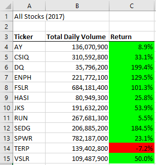
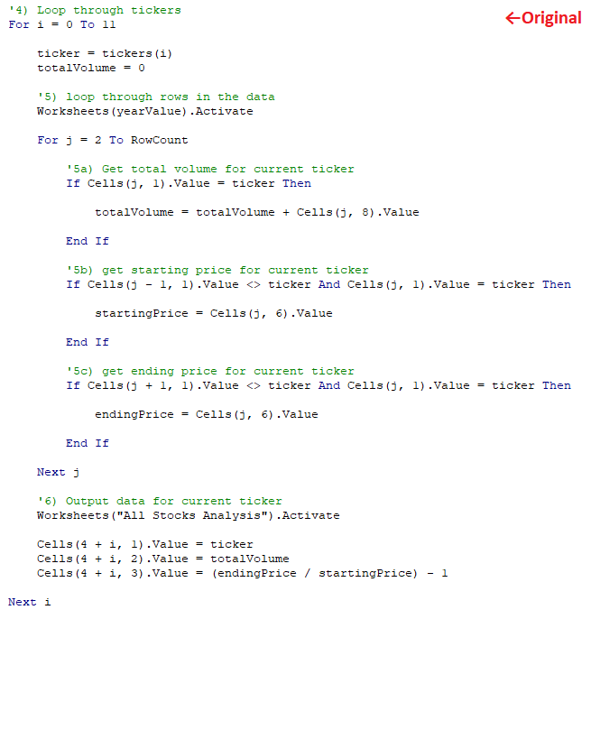
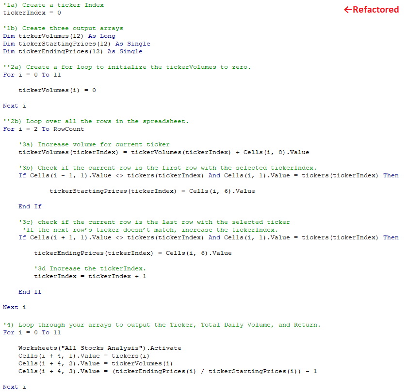
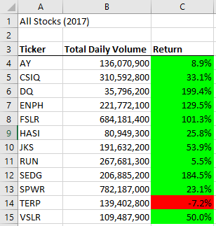
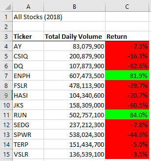
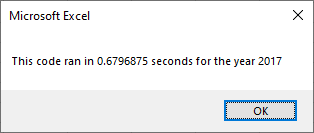
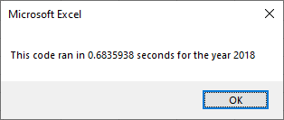
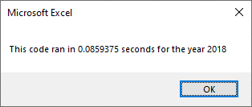

# VBA Analysis of Green Stocks

## Overview of Project
Steve's parents invested all of their money into a single green energy stock, DAQO New Energy Corporation. Steve realizes this is a poor financial decision and encourages them to diversify their portfolio with other green energy stocks. To do so, he needs to analyze stock data for additional green energy stocks. In this module, we built a VBA script to automate these analyses.

### Purpose
Originally, Steve's analysis only focused on 12 stocks, but he wants to expand his analysis to the entire market. However, our original code contains some inefficiencies which could drastically increase its runtime if we perform a broader analysis of thousands of stocks instead of just 12. In this Challenge, the script is refactored to remove those inefficiencies and make it run faster.

## Results

### Stock Performance: 2017 vs. 2018
The results of the VBA script analyzing 12 green energy stocks in 2017 and 2018 can be seen below. The analysis calculated two quantities for each stock: the total daily volume (which is the daily volume summed over an entire year) and the return (which is the percentage change in the stock's price at the end of the year compared to the beginning of the year). To simplify the analysis, the Return values were highlighted in green if they were positive and red if they were negative.

Looking at the 2017 data, nearly all of the stocks performed well that year. The price DQ, for instance, increased by almost 200%. Only one stock had a negative return that year: TERP. 2018, however, was a different story. Nearly all of the stocks lost value that year, except for two: ENPH and RUN. The only two stocks that had positive returns in *both* years were ENPH and RUN; thus, these two stocks should be considered for future investment.

### Refactoring of VBA Script
The original and refactored scripts are compared below. For brevity, duplicate portions of code are omitted.

The outputs from the refactored code match the results from the original code.

The most striking difference between the two portions of code, which accounts for the majority of the inefficiency, is that the original code uses a nested For loop which scans through the data to perform the requisite calculations **12 times**. The refactored code uses pre-defined arrays to store the results so that the data only has to be scanned through **1 time**.

The runtime for each script was measured for quantitative comparison, shown below for the original code (left) and refactored code (right) for both 2017 and 2018.

The refactored code reduces the runtime by a factor of **~8**. The difference in runtime is imperceptible for this small dataset of only 12 stocks (0.7 sec vs. 0.1 sec), but if this code were run on the entire set of thousands of stock data, the time savings could be substantial.

## Summary

### Advantages and Disadvantages of Refactoring Code
The biggest advantage of refactoring code is the time savings. As mentioned above, the time savings here were negligible, but with larger data sets, the refactored code could mean the difference between the script taking minutes to run versus hours to run. Another benefit of refactored code is that it reduces computer resource usage. If a script combing through a large dataset is inefficient, it may overflow the system's RAM and cause it to crash.

One disadvantage to refactoring code is potentially making it harder to follow. Inefficient code is often easier to understand because it runs through sequential steps as if telling a story. By combining steps to improve efficiency, the "story" can become convoluted and harder to follow. Another disadvantage is that rewriting code can introduce errors and require debugging. If the script is going to be run once, it might not be worth the time and effort to refactor and debug. However, if the script will be used continuously, the time spent refactoring and debugging will pale in comparison to the time savings from more efficient code.

### Advantages and Disadvantages of Original and Refactored VBA Script
The most obvious advantage of the refactored code is the 8x reduction in runtime. The disadvantage is that it took an hour to refactor the code to achieve a time savings of ~0.6 seconds. The advantageous runtime reduction will only become apparent with a much larger dataset.